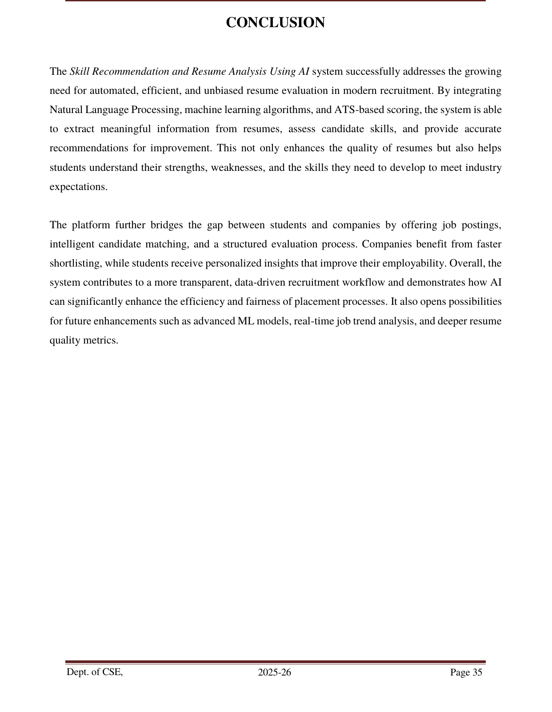

# Placify — ISRO Secure Data Management & Decision Support System

> Built during a Software Engineering Internship at **ISRO (Indian Space Research Organisation)**. A secure, multi-user placement management platform combining Multi-Factor Authentication (MFA), Role-Based Access Control (RBAC), AI-based resume analysis, and a Decision Support System (DSS) for placement analytics.


> **Note:** This repository contains an independently-built demo implementation created to showcase the MFA, RBAC, and Decision Support System concepts developed during my ISRO internship. It uses synthetic/dummy data and does not contain any ISRO source code, internal data, or proprietary information.

---

## Overview

Placify is a secure, role-based placement management platform connecting **Students**, **Companies**, and **Admins**. It handles the full placement lifecycle — registration, resume screening, job postings, applications, and approvals — behind an OTP-secured, role-scoped access layer, with an admin-facing Decision Support System for placement analytics.

**Team:** Amarthya B S, Amrutha G, Anupriya K V, Bhavana P

---

## How It Works

### 1. Three separate login portals
The home page routes users into one of three logins — **Student**, **Company**, or **Admin** — each with its own authentication flow and permission scope (RBAC).


### 2. Home page
A public landing page introduces the platform before login.


### 3. Student registration & OTP-based MFA
New students fill in personal and academic details and upload a resume. On login, the system emails a one-time password (OTP) — this is the Multi-Factor Authentication layer — before granting access. On successful registration, the system auto-generates a secure password and emails login credentials to the student.

### 4. Student dashboard
Once logged in, students see their personal and academic information, CGPA and backlog summary, placement status, and can browse/apply to jobs or run resume analysis.

### 5. Resume analysis (Basic & Advanced)
Students can upload a resume for instant analysis:
- **Basic analysis** extracts name, email, phone, skills, college, degree, and returns a recommended job category
- **Advanced analysis** additionally computes an ATS compatibility score, readability score, job-description match percentage, keyword frequency, missing skills, and job-role recommendations with match scores


### 6. Admin dashboard (Decision Support System)
Admins get a bird's-eye view: total students, companies, jobs, and application status counts, plus placement-status distribution and branch-vs-students charts — the Decision Support System layer that helps administrators spot trends and make informed placement decisions.


### 7. Company management
Admins can add new companies (multi-step form: basic details, contact info, etc.) and view/search the full company list, with export to PDF.



### 8. Student list & resume analysis history
Admins can view/search all registered students and export to PDF. Students can view their own resume analysis history — every past upload, with ATS score, skill count, and readability trend over time.


---

## Key Features

- **Multi-Factor Authentication (MFA)** — OTP-based (SMTP email) login for students, on top of password authentication
- **Role-Based Access Control (RBAC)** — Student, Company, and Admin each have a distinct, permission-scoped view; admin approval gates new student/company registrations
- **Decision Support System (DSS)** — placement statistics, branch-wise trends, and resume-quality analytics surfaced on the admin dashboard
- **NLP-Based Resume Parsing** — extracts name, email, phone, skills, education, and experience from PDF/DOCX resumes
- **ATS Scoring & Job Description Matching** — scores a resume against a pasted job description, with keyword-level feedback
- **Skill Gap Analysis & Job Role Recommendations** — flags missing skills and ranks the best-fit job roles for a candidate
- **Job Posting & Application Workflow** — companies post jobs; students apply; admins/companies accept or reject applications
- **Auto-generated Secure Credentials** — random strong passwords generated and emailed on registration, hashed with Werkzeug before storage
- **PDF Export** — student list and company list can be exported/downloaded as PDF

---

## Tech Stack

| Layer | Technology |
|---|---|
| Backend | Python, Flask |
| NLP / Parsing | pyresparser, spaCy, NLTK, PyPDF2, docx2txt |
| ML | scikit-learn (TF-IDF + classifier for job-category prediction) |
| Database | SQLite3 |
| Auth | Werkzeug password hashing, SMTP-based OTP email |
| Frontend | HTML, CSS, JavaScript (Jinja2 templates) |
| Config | python-dotenv for environment-based secrets |

---

## Project Structure

```
Placify-main/
├── app.py                  # Main Flask application — routes, auth, business logic
├── database.py              # Database helper functions (student/company creation, password gen)
├── graphs_students.py        # Generates placement/analytics charts for the DSS dashboard
├── requirements.txt
├── .env.example              # Template for required environment variables
├── templates/                # Jinja2 HTML templates (login, dashboards, forms, lists)
├── static/
│   ├── images/                # Site images
│   ├── stu/, models/           # Generated analytics chart images
│   └── uploads/                # Uploaded resumes (gitignored — not committed)
└── screenshots/               # README screenshots
```

---

## Running It Locally

### 1. Clone and install dependencies
```bash
git clone https://github.com/<your-username>/isro-secure-data-management-dss.git
cd isro-secure-data-management-dss
pip install -r requirements.txt
```

### 2. Set up environment variables
Copy `.env.example` to `.env` and fill in your own values:
```bash
cp .env.example .env
```
```
FLASK_SECRET_KEY=<generate with: python -c "import secrets; print(secrets.token_hex(32))">
SENDER_EMAIL=<your gmail address>
SENDER_EMAIL_PASSWORD=<a Gmail App Password — not your normal password>
ADMIN_EMAIL=<choose an admin login email>
ADMIN_PASSWORD=<choose a strong admin password>
```
> To get a Gmail App Password: enable 2-Step Verification on your Google account, then generate one at [myaccount.google.com/apppasswords](https://myaccount.google.com/apppasswords).

### 3. Run the app
```bash
python app.py
```
The app will start on `http://127.0.0.1:5000` (or the port Flask reports). The SQLite database and required tables are created automatically on first run.

### 4. Log in
- **Admin:** use the `ADMIN_EMAIL` / `ADMIN_PASSWORD` you set in `.env`
- **Student / Company:** register through the sign-up flow — credentials are emailed to the address you register with (OTP-based login)

---

## My Contribution

Worked as part of a four-person team during the ISRO internship on:
- **OTP-based MFA and RBAC implementation** securing the multi-user platform across Student, Company, and Admin roles
- The resume parsing pipeline (text extraction, field detection, regex-based structuring)
- The skill recommendation logic mapping current skills to related/missing skills
- Resume analysis result presentation (ATS scoring display, skill gap breakdown, job role match cards)
- Dashboard and reporting features feeding into the Decision Support System

---

## Security Notes

This repository has been sanitized for public sharing:
- No real credentials, API keys, or SMTP passwords are committed — all secrets are loaded from environment variables (see `.env.example`)
- No real student/company database or uploaded resumes are included
- The admin login uses environment-variable-based credentials, not hardcoded values

---

## Roadmap

- [x] OTP-based MFA
- [x] Role-based access control (Student / Company / Admin)
- [x] NLP-based resume parsing
- [x] ATS compatibility scoring & job description matching
- [x] Skill gap analysis & job role recommendations
- [x] Admin decision support dashboard with placement analytics
- [x] Resume analysis history tracking
- [ ] Advanced ML models for higher parsing accuracy
- [ ] Real-time job market trend integration
- [ ] Recruiter-facing dashboard
